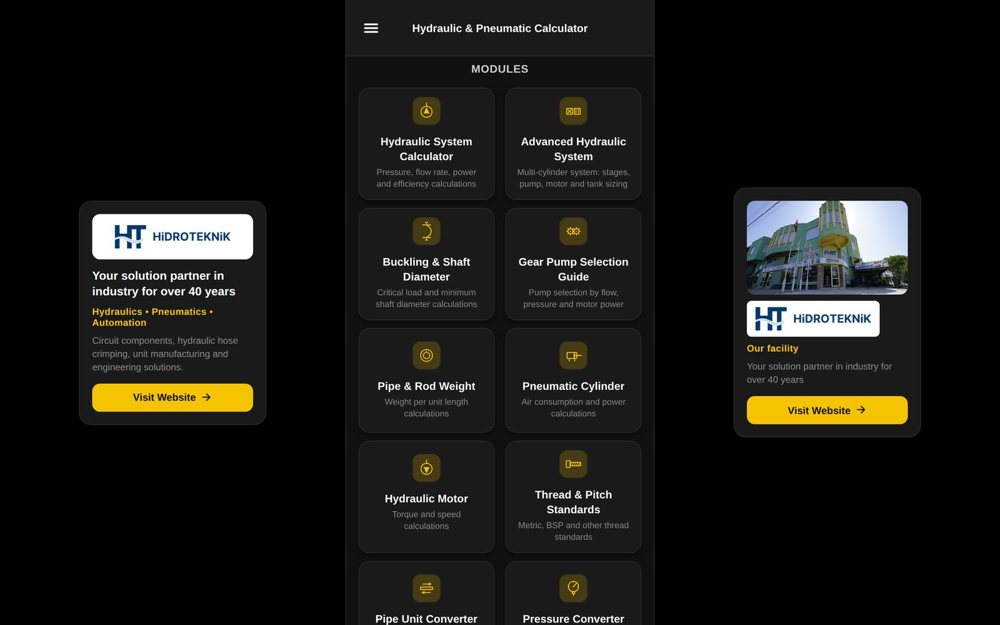

# Hydraulic & Pneumatic Calculator

**Free, open-source calculators for hydraulic and pneumatic system design.**
Pump flow, cylinder force, motor torque, accumulator sizing, buckling, thread
identification and more, in one app that runs in the browser and on Android.

**Use it now:** [calculate.hidroteknik.com.tr](https://calculate.hidroteknik.com.tr) ·
[Android app](https://play.google.com/store/apps/details?id=com.hidroteknik.hydrauliccalculator)



Built by [Hidroteknik](https://www.hidroteknik.com.tr), a hydraulics and pneumatics
manufacturer and distributor in Denizli, Türkiye, operating since 1984. These are the
calculations our own engineers and service technicians use every day.

## Modules

| Module | What it calculates |
|---|---|
| Hydraulic System | Pressure, flow, power, cylinder push/pull force and speed (F = P × A) |
| Advanced Hydraulic System | Multi-cylinder systems: stage-by-stage pump, motor and tank sizing |
| Buckling & Shaft Diameter | Euler critical load and minimum rod diameter, four end conditions |
| Gear Pump Selection | Pump selection by flow, pressure and motor power |
| Pipe & Rod Weight | Weight per metre by material and size |
| Pneumatic Cylinder | Force, air flow and air consumption |
| Hydraulic Motor | Torque, power and speed |
| Thread & Pitch Standards | Identify Metric, BSP, NPT, UNF and UNC threads from measurements |
| Pipe Unit Converter | DN, inch and mm conversions with a pipe table |
| Pressure Converter | bar, psi, MPa, kPa, atm, mmHg |
| Flow Velocity | Line sizing by recommended flow velocity |
| Accumulator Sizing | Accumulator volume and nitrogen pre-charge (Boyle's law) |

Every module is available in **English and Turkish**. Each one also has a
step-by-step [calculation guide](https://calculate.hidroteknik.com.tr/guide/) with the
formulas explained.

## Tech stack

- [Expo](https://expo.dev) (React Native) with a single codebase for Android and web
- React Navigation (drawer + stack), `i18next` for TR/EN
- Web build deployed on Vercel (`npx expo export -p web`)
- Android builds via EAS
- Static, SEO-friendly guide pages generated by `scripts/gen-guides.js` into `public/guide/`

## Run locally

You need [Node.js](https://nodejs.org) 20 or newer.

```bash
npm install
npm run web        # opens the app in your browser
npm run android    # Android emulator or device (Expo Go)
```

Build the static web version:

```bash
npx expo export -p web   # output in dist/
```

## Project structure

```
App.tsx                  entry point
src/
  screens/               one screen per calculator module
  components/            shared UI (results, tooltips, diagrams)
  components/diagrams/   SVG diagrams (cylinder, accumulator, buckling, pipes, threads)
  data/                  gear pump and thread standard tables
  i18n/locales/          en.json, tr.json
  navigation/            drawer and stack navigation
scripts/                 guide page and app icon generators
public/guide/            generated calculation guides
```

## Contributing

Found a wrong result, a missing standard or a formula you'd like added?
[Open an issue](../../issues). Please include the inputs you used and the value you
expected. Pull requests are welcome, especially new modules and translations.

## Disclaimer

Results are for preliminary design and reference. Always verify critical calculations
against manufacturer data and applicable standards.

## License

Source code: [MIT](LICENSE) © 2026 Hidroteknik A.Ş.
The Hidroteknik name, logo and photographs are not covered by the license.
